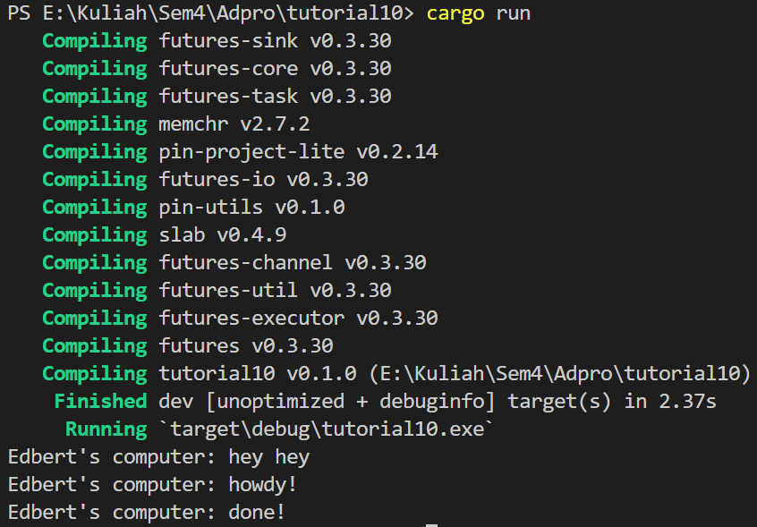

# Understading how it works

- Hasil print `hey hey`  muncul terlebih dahulu karena berada di luar fungsi async. `hey hey` muncul terlebih dahulu karena fungsi tetap melanjutkan program saat menunggu hasil future dari proses async yang berada diatasnya.