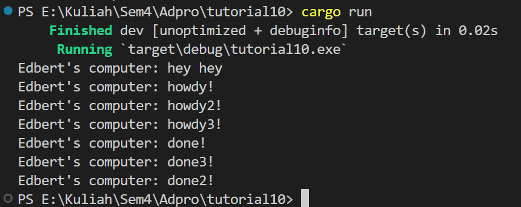
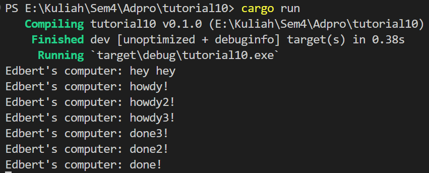

# 1.2: Understading how it works

- Hasil print `hey hey`  muncul terlebih dahulu karena berada di luar fungsi async. `hey hey` muncul terlebih dahulu karena fungsi tetap melanjutkan program saat menunggu hasil future dari proses async yang berada diatasnya.

## 1.3: Multiple Spawn and removing drop
### Drop on

### Drop off

Dari keluaran yang dihasilkan, dapat dilihat bahwa banyak spawner menyebabkan lebih banyak task yang dilakukan karena lebih banyak task yang dimasukkan ke task sender, yang bertindak seperti message queue. Tidak menghapus spawner menyebabkan program tidak mati karena program menganggap akan ada transmisi data oleh spawner. drop(spawner) merupakan indikasi bahwa interaksi selesai dan spawner akan ditutup. Saat spawner memanggil fungsi spawn, spawner akan membuat task baru yang disalurkan ke task sender. Executor akan mengambil satu task dari task sender dan mengeksekusinya, kemudian mengambil task berikutnya sampai task habis dan spawner di drop, yang menunjukkan interaksi telah selesai.